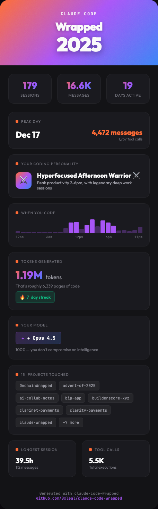

# Claude Code Wrapped 🎁

Generate a beautiful, shareable "Wrapped" image from your Claude Code usage stats — perfect for showing off your AI-assisted coding on socials.

Since claude does not provide an API to access these stats we have to use local files.



## What You Get

A shareable card featuring:
- **Total sessions, messages, and days active**
- **Peak day** — your most intense coding session
- **Coding personality** — Night Owl? Afternoon Warrior?
- **Hour-of-day heatmap** — when you code
- **Tokens processed** — output + cache + input totals
- **Model usage** — which Claude model you vibed with
- **Projects touched** — repos you worked on
- **Local codebase size** — projects, files, lines
- **Coding rhythm** — day-of-week heatmap from commits
- **Code churn by hour** — when changes land
- **Git history** — commits, lines added/deleted, recent churn
- **Language mix** — top file types by lines
- **Longest session** and **coding streaks**

## Quick Start

```bash
# Clone the repo
git clone https://github.com/0xleal/claude-code-wrapped.git
cd claude-code-wrapped

# Install dependencies (optional - only needed for auto PNG)
pip install -r requirements.txt

# Generate your wrapped
python generate.py
```

Your wrapped image will be saved to `output/wrapped.png`.
If you don't pass `--code-dir`, the script will prompt you for a project folder.

## Requirements

- Python 3.10+
- Claude Code installed and used (data in `~/.claude/`)
- (Optional) Playwright for PNG generation

### Installing Playwright (for automatic PNG generation)

```bash
pip install playwright
playwright install chromium
```

Without Playwright, the script will generate an HTML file you can screenshot manually.

## Usage

```bash
# Basic usage — reads from ~/.claude/, outputs to output/wrapped.png
python generate.py

# Custom output path
python generate.py --output my_wrapped.png

# Just generate HTML (open in browser to screenshot)
python generate.py --html-only

# Just see your stats as JSON
python generate.py --stats-only

# Use a different .claude directory
python generate.py --claude-dir /path/to/.claude

# Set your project folder (for local codebase + git stats)
python generate.py --code-dir /path/to/projects

# Max stats mode (include hidden + nested repos, larger files)
python generate.py --max-stats

# Fine-grained scan controls
python generate.py --include-hidden --include-nested-repos --max-file-size-mb 10 --relax-excludes

# Skip git history aggregation (faster)
python generate.py --skip-git

# Redact project names (privacy-safe)
python generate.py --redact-projects --redact-prefix-len 3

# Estimate tokens across all projects (size-weighted)
python generate.py --estimate-tokens

# Scale token estimate using git history (lifetime-style)
python generate.py --estimate-tokens --estimate-by-commits
```

## Data Sources

The tool reads from your local Claude Code data:

| File | What it contains |
|------|------------------|
| `~/.claude/stats-cache.json` | Pre-computed daily stats, tokens, sessions |
| `~/.claude/projects/` | List of projects you've worked on |
| `~/.claude/history.jsonl` | Conversation history (for future features) |
| `/path/to/projects` | Local folders + git history for codebase stats |

**Privacy note:** All processing happens locally. No data is sent anywhere.

## Customization

### Editing the template

The card design lives in `wrapped.html`. It's self-contained HTML/CSS/JS that you can customize:

- Colors: Edit the CSS variables in `:root`
- Layout: Modify the HTML structure
- Stats: Add/remove sections in the HTML and update `render()` function

### Adding new stats

1. Add parsing logic to `parse_stats.py`
2. Add the field to the `WrappedStats` dataclass
3. Update `wrapped.html` to display it

## How It Works

1. **Parse** — Reads `~/.claude/stats-cache.json` and project directories
2. **Compute** — Calculates derived stats (streaks, personality, pages of code)
3. **Scan** — Walks your project folder and git history (optional)
4. **Render** — Injects data into HTML template
5. **Screenshot** — Uses Playwright to capture PNG (or outputs HTML)

## Example Output

```
🎁 Claude Code Wrapped Generator
========================================

📊 Parsing stats from /Users/you/.claude...

✓ Found 179 sessions across 19 days
  • 16,594 messages exchanged
  • 1,185,553 tokens processed (incl. cache)
  • 14 projects touched
  • Peak day: 2025-12-17 (4,472 messages)
  • Your vibe: Hyperfocused Afternoon Warrior

🎨 Generating HTML...
  ✓ output/wrapped.html

📸 Generating PNG...
  ✓ Generated PNG with Playwright: output/wrapped.png

✅ Your Claude Code Wrapped is ready!
   output/wrapped.png

   Share it on socials! 🚀
```

## Contributing

PRs welcome! Some ideas:

- [ ] More personality types
- [ ] Language/framework detection from projects
- [ ] Tool usage breakdown (if we can find the data)
- [ ] Animated version
- [ ] Multiple card themes

## License

MIT — do whatever you want with it.

---

Built with Claude Code, obviously. 🤖
